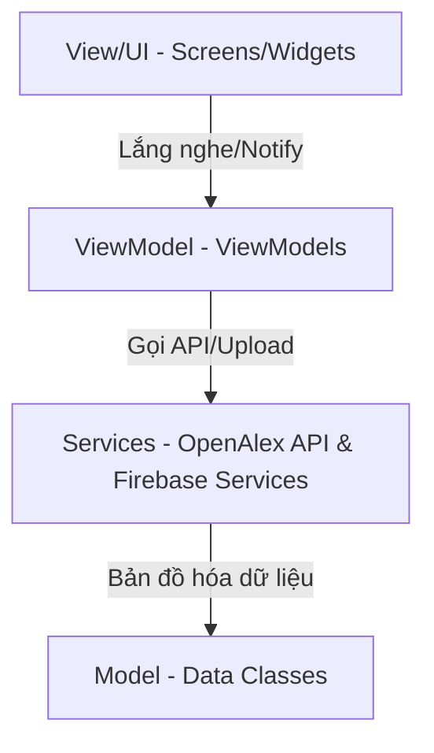

# Journal Trend Analyzer – Hướng Dẫn Kỹ Thuật (Technical Guide)

Chào mừng bạn đến với **Journal Trend Analyzer** – ứng dụng Flutter phân tích xu hướng tạp chí nghiên cứu khoa học kết hợp các dịch vụ Firebase Cloud, kiểm thử tự động Patrol và kiến trúc MVVM tiêu chuẩn.

---

## 1. Kiến Trúc Ứng Dụng (MVVM Architecture)

Ứng dụng được xây dựng theo mô hình **Model-View-ViewModel (MVVM)** kết hợp với thư viện **Provider** để quản lý trạng thái (state management), giúp tách biệt hoàn toàn giữa giao diện (UI) và logic nghiệp vụ.



### Cấu Trúc Thư Mục Dự Án:
```text
lib/
├── models/         # Khai báo các thực thể dữ liệu (Publication, Domain, JournalStats, KeywordStats)
├── services/       # Xử lý kết nối API OpenAlex (OpenAlexService)
├── firebase/       # Chứa các dịch vụ Firebase (Auth, FCM, Storage, Analytics, Crashlytics, Remote Config)
├── viewmodels/     # Điều phối dữ liệu giữa Services và UI (AuthViewModel, HomeViewModel, ...)
├── screens/        # Giao diện chính (Home, Journals, Keywords, Profile, Login)
├── widgets/        # Các widget tái sử dụng (PublicationCard, v.v.)
└── utils/          # Bộ công cụ phụ trợ (PdfGenerator xuất báo cáo PDF)
```

---

## 2. Tích Hợp Các Dịch Vụ Firebase

Ứng dụng tích hợp sâu **6 dịch vụ Firebase** chính:

| Dịch vụ Firebase | Tập tin nguồn | Vai trò trong ứng dụng |
| :--- | :--- | :--- |
| **Authentication** | `lib/firebase/auth_service.dart` | Đăng nhập an toàn bằng tài khoản Google (Google Sign-In) |
| **Cloud Storage** | `lib/firebase/storage_service.dart` | Lưu trữ tệp tin PDF báo cáo khoa học được xuất từ app |
| **Cloud Messaging (FCM)** | `lib/firebase/fcm_service.dart` | Đăng ký nhận thông báo đẩy và lưu lịch sử thông báo |
| **Analytics** | `lib/firebase/analytics_service.dart` | Ghi nhận hành vi người dùng, lượt tra cứu và xuất PDF |
| **Crashlytics** | `lib/firebase/crashlytics_service.dart` | Theo dõi và giám sát lỗi sập ứng dụng theo thời gian thực |
| **Remote Config** | `lib/firebase/remote_config_service.dart` | Cấu hình giới hạn số lượng hiển thị trên danh sách UI động |

### Các Sự Kiện Firebase Analytics Được Theo Dõi:
- `login`: Người dùng đăng nhập thành công.
- `search_topic`: Người dùng tìm kiếm chủ đề (`keyword`).
- `view_publication`: Người dùng xem bài viết khoa học (`publication_title`, `publication_year`).
- `view_journal`: Người dùng xem chi tiết tạp chí (`journal_name`).
- `view_keyword`: Người dùng xem chi tiết từ khóa (`keyword`).
- `export_pdf`: Người dùng xuất báo cáo (`topic`).
- `logout`: Người dùng đăng xuất khỏi hệ thống.

---

## 3. Quy Trình Xuất Báo Cáo PDF
Khi người dùng thực hiện xuất báo cáo tại màn hình Hồ sơ:
1. Ứng dụng gọi OpenAlex API để lấy dữ liệu nghiên cứu về chủ đề được chọn.
2. `PdfGenerator` (`lib/utils/pdf_generator.dart`) sẽ biên dịch và vẽ bố cục tài liệu PDF (chứa bảng thống kê tạp chí hàng đầu, danh sách bài báo có trích dẫn cao nhất).
3. Đẩy luồng byte PDF lên Firebase Storage thông qua `StorageService`.
4. Trả về liên kết tải xuống công khai để người dùng sao chép hoặc mở trực tiếp trên trình duyệt.

---

## 4. Hướng Dẫn Cài Đặt & Chạy Ứng Dụng

### Yêu Cầu Hệ Thống:
- Flutter SDK v3.11.5 hoặc mới hơn.
- Thiết bị Android/iOS hoặc Trình giả lập (Emulator).
- Đã cài đặt Firebase CLI (nếu cần cấu hình lại Firebase).

### Các Bước Thực Hiện:

1. **Tải các gói phụ thuộc (Dependencies):**
   ```bash
   flutter pub get
   ```

2. **Cấu hình Google Sign-In & Firebase:**
   - Đảm bảo tệp `android/app/google-services.json` (Android) hoặc `ios/Runner/GoogleService-Info.plist` (iOS) đã được cấu hình chính xác với Firebase project của bạn.
   - Thêm vân tay SHA-1 và SHA-256 của máy phát triển vào Firebase Console để kích hoạt Google Sign-In.

3. **Khởi chạy ứng dụng:**
   ```bash
   flutter run
   ```

---

## 5. Hướng Dẫn Chạy Kiểm Thử (Testing Guide)

### 5.1 Widget Tests (Kiểm Thử Giao Diện Độc Lập)
Chúng tôi đã xây dựng bộ kiểm thử giao diện bao phủ toàn bộ 5 màn hình chính (`LoginScreen`, `HomeScreen`, `JournalsScreen`, `KeywordsScreen`, và `ProfileTabScreen`) sử dụng các Mock ViewModel/Service để chạy độc lập không cần kết nối mạng hay Firebase thực tế.

Chạy lệnh sau để kiểm tra:
```bash
flutter test
```

### 5.2 Patrol E2E Tests (Kiểm Thử Toàn Trình)
Ứng dụng sử dụng framework **Patrol** để thực hiện kiểm thử tự động hóa luồng người dùng trên thiết bị thực tế/giả lập. Kịch bản kiểm thử nằm tại `integration_test/app_test.dart`.

Các bước thực hiện kiểm thử E2E:
1. Khởi động một trình giả lập Android hoặc kết nối thiết bị thật qua USB Debugging.
2. Chạy lệnh Patrol Test:
   ```bash
   patrol test -t integration_test/app_test.dart
   ```
